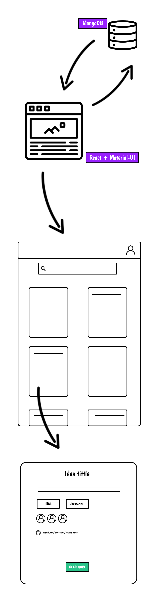

# Design and technologies 

Information about what is the project make of and how all parts are connected. 

## What technologies is the project make of?

- [MongoDB](https://www.mongodb.com/) for backend
- [Material UI](https://material-ui.com/) for looks and feels. 
- [React](https://reactjs.org/) for the logic

## General structure design and application design 

